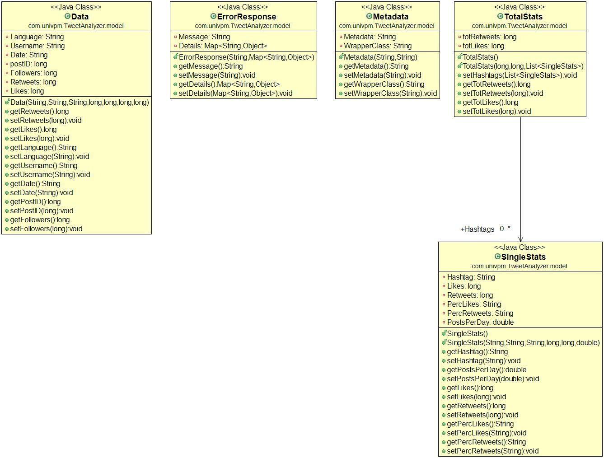

# Tweets Analyzer

Tweets Analyzer è una Spring Boot Web App sviluppata in Java, in grado di interfacciarsi con le API Search di Twitter per raccogliere dati inerenti ad alcuni hashtag a scelta dell'utente, al fine di sviluppare uno studio di analisi statistica e di impatto sui dati raccolti.

All'avvio dell'applicazione, viene eseguito in automatico il download dei dati dei tweets (per raccogliere un massimo di 100 post fino a 7 giorni prima, caratteristica dell'API Search di base) relativi agli hashtags nel file di testo ***hashtags.txt***, contenuto nella cartella ***Files***:

 - **Prada**  
 - **Armani**   
 - **Ferragamo**   
 - **Gucci**   
 - **Versace**  
 - **Trussardi**  
 - **Valentino**   
 - **Zegna**
 - **Dior**
 - **Benetton**

Se l'utente **non** modifica il file, verranno scaricati i dati degli hashtags già presenti nel suddetto file.

Quest'ultimo deve essere scritto dall'utente in modo tale che i nomi relativi a ciascun hashtag si trovino incolonnati uno sotto l'altro. 
Il file **non** deve essere vuoto. Inoltre **non** sono ammessi caratteri come lo spazio, o caratteri speciali (es: ***#***) sulla stessa riga.

Eventuali errori di inserimento da parte dell'utente sono gestiti in ogni caso da opportune eccezioni.

Una volta raccolti **tutti** i dati, quest'ultimi vengono restituiti sotto forma di file JSON. Si procede dunque al parsing dei campi di interesse all'interno di una Map creata per l'occasione.

I **campi di interesse** scelti per l'analisi sono i seguenti: 

 - **Hashtag** 
- **Data** 
- **PostID**
- **Username** 
- **Language** 
- **Followers**
- **Retweets** 
- **Likes** 

Per il test della Web App viene utilizzato **POSTMAN**, un tool utile per il testing delle API.

## Utilizzo della Spring Web App

La Spring Web App da noi sviluppata permette di utilizzare le seguenti funzioni mediante richieste **API REST (GET o POST)** :

|Tipo di Chiamata|Rotta| Descrizione |
|--|--|--|
|**GET**| **/metadata** | Elenco dei campi di interesse per l'analisi e il tipo di dato contenuto |
|**GET**|**/data**| Elenco dei dati dei tweets raccolti
|**POST**|**/data**| Elenco dei dati sottoposti a filtri applicati dall'utente  
|**GET**|**/stats**| Statistiche su alcuni parametri dei tweets
|**POST**|**/stats**| Statistiche su alcuni parametri dei tweets, dopo essere stati filtrati

## Rotte dell'applicazione
Avviata l'app, quest'ultima sarà raggiungibile all'indirizzo *localhost:8080*. Le seguenti rotte, con le relative richieste, possono essere inserite in Postman per accedere alle funzionalità dell'app:

> **GET /metadata**

Restituisce i metadata (ovvero i campi d'interesse analizzati) precedentemente specificati.

> **GET /data**

    "Prada":  {
         "0":  {
                "postID": 1271368152404725762,
                "language":  "zh",
                "date":  "Fri Jun 12 09:06:03 +0000 2020",
                "username":  "pincoppalino",
                "followers":  39,
                "likes":  2,
                "retweets":  0
            },
            {
            ....

Restituisce tutti i dati scaricati in seguito all'avvio della app e al login all'interno dell'API.

> **GET /stats**

    [
       {
        "hashtag":  "Prada",
        "total likes":  1089882,
        "total retweets":  15013,
        "percLikes":  "3.8%",
        "percRetweets":  "0.76%",
        "postsPerDay":  48.5
        },
        {
        ...
     ]

Restituisce le statistiche sul numero di Likes e Retweets totalizzati per ogni hashtag, oltre ad una percentuale di likes e retweets sul totale dei post analizzati e al numero di post al giorno.

> **POST /data**

Questa particolare chiamata, a seguito dell'inserimento di determinati parametri passati all'app attraverso un body, restituisce dei dati filtrati.

> **POST /stats**

Questo metodo restituisce delle statistiche su un numero limitato di dati. Infatti, specificando la rotta ***/stats*** con chiamata ***POST***, viene data all'utente la possibilità di inserire un filtro per limitare il numero di dati da analizzare. In seguito all'inserimento dei parametri di filtraggio all'interno del body, verranno restituite delle statistiche sui tweets filtrati.    

## Filtri

I filtri realizzati sono i seguenti:

|Chiave del Filtro| Descrizione |
|--|--|
| "#" | Filtra in base ad uno o più hashtag |
| "Language" | Filtra in base ad una o più lingue 
| "Followers" | Filtra i tweets scritti dagli accounts con un certo numero (oppure un intervallo) di followers 
| "Retweets" | Filtra i tweets che hanno avuto un certo numero (oppure un intervallo) di retweets 
| "Likes" | Filtra i tweets che hanno avuto un certo numero (oppure un intervallo) di likes 
| "After" | Filtra i tweets scritti **dopo** una determinata Data e Ora 
| "Before" | Filtra i tweets scritti **prima** di una determinata Data e Ora 
| "Between" | Filtra i tweets **compresi** tra due determinate Date e Ore 

### "#":

L'utente può generare un body del tipo: 

    {
      "#" : "Prada"
    }

per avere restituiti soltanto i tweets relativi all'hashtag Prada.

Oppure può essere scritto un body del tipo: 

    {
      "#" : [ "Prada", "Gucci", "Dior", ...]
    }

per avere restituiti soltanto i tweets relativi agli hashtags Prada, Gucci e Dior.

### "Language":

L'Utente può generare un body del tipo: 

    {
      "Language" : "en"
    }

per avere restituiti soltanto i tweets scritti in lingua inglese.

Oppure può essere scritto un body del tipo: 

    {
      "Language" : [ "it", "es", "ja"]
    }

per avere restituiti soltanto i tweets scritti in lingua italiana, spagnola e giapponese.
È buona norma scrivere le lingue in conformazione al ***Codice di lingua IETF***, al fine di non generare eccezioni.

### "Followers", "Retweets", "Likes":

L'Utente può generare un body del tipo: 

    {
       KEY : [ ">", "150" ]
    }

con **KEY = "Followers"**, oppure **KEY = "Retweets"**, oppure **KEY = "Likes"** per avere restituiti soltanto i tweets con numero di likes, retweets, o scritti da account con numero di followers **maggiori di 150**.

Oppure può essere scritto un body del tipo: 

    {
       KEY : [ "<", "150" ]
    }

con **KEY = "Followers"**, oppure **KEY = "Retweets"**, oppure **KEY = "Likes"** per avere restituiti soltanto i tweets con numero di likes, retweets, o scritti da account con numero di followers **minori di 150**.

Oppure può essere scritto un body del tipo: 

    {
       KEY : [ "150", "350" ]
    }

con **KEY = "Followers"**, oppure **KEY = "Retweets"**, oppure **KEY = "Likes"** per avere restituiti soltanto i tweets con numero di likes, retweets, o scritti da account con numero di followers **compresi tra 150 e 350**.

### "After", "Before", "Between":

L'Utente può generare un body del tipo: 

    {
      "After" : "10/05/2020 15:30"
    }

per avere restituiti soltanto i tweets scritti **dopo** le 15:30 del giorno 10/05/2020.

Oppure può essere scritto un body del tipo: 

    {
      "Before" : "10/05/2020 15:30"
    }

per avere restituiti soltanto i tweets scritti **prima** le 15:30 del giorno 10/05/2020.

Oppure può essere scritto un body del tipo:

    {
      "Between" : [ "10/05/2020 15:30", "12/05/2020 19:45" ]
    }

per avere restituiti soltanto i tweets scritti in una fascia di tempo **compresa** tra le ore 15:30 del giorno 10/05/2020 e le ore 19:45 del giorno 12/05/2020.
È buona norma seguire la formattazione della data qui rappresentata, al fine di non generare eccezioni.

### Filtri Complessi

E' anche possibile costruire un filtro complesso, composto di più parametri, per applicare molteplici filtri di diversa natura, per esempio rispetto ad uno o più hashtags, uniti ad una data o un linguaggio

    [
      {
      "#" : [ "Gucci", "Dior" ]
      }, 
      {
      "Language" : "en"
      }, 
      {
      "Between" : ["07/06/2020 8:00", "09/06/2020 12:15"]
      }
    ]

È buona norma non utilizzare chiavi duplicate al fine di non generare eccezioni.

## Gestione delle eccezioni

Sono state sviluppate anche delle eccezioni personalizzate, che vengono lanciate a seconda dei diversi errori generati:

 
|Eccezione| Descrizione |
|--|--|
| **DuplicateFilterException** |Se il filtro è composto da più filtri contenenti la stessa chiave |
|**IllegalFilterValueException** | Se uno dei valori inseriti dall'utente nel filtro è errato
|**IllegalTimeException**| Se un'eventuale data del filtro è stata inserita in un modo **NON** consentito
|**IllegalFilterValueSizeException**| Se uno dei valori inseriti dall'utente nel filtro è di dimensione **NON** consentita
|**IllegalFilterKeyException**| Se una delle chiavi inserite dall'utente nel filtro è errata
|**StatisticsNotAppliedException**| Se per qualche ragione non è stato possibile calcolare Statistiche sui Tweet

## CLASSI DI TEST

Sono state realizzate anche 5 classi di test, per andare a verificare il corretto funzionamento delle varie componenti dell'applicazione. 

Dapprima è stato inizializzato un database fittizio (ActualData), che simula la presenza di dati di alcuni posts, legati ai metadata già specificati. 

Successivamente, sono stati testati alcuni metodi **fondamentali** del programma tramite i metodi di **assert** (nello specifico **assertEquals(), assertIterableEquals(), assertThrows()**). 

Le seguenti classi servono a confrontare il risultato aspettato (***expected***) con il risultato reale (***actual***) ritornato dal metodo usato, per verificarne l'esattezza: 

| Classe di test | Descrizione | Tipo di assert
|--|--|--|
| **DatabaseClassTest** | Testa la corretta lettura degli hashtags dal file di testo nel path specificato, confrontandoli con il risultato aspettato | assertIterableEquals()
|**ProperFilterTest**| Testa l'applicazione di un filtro sbagliato al metodo filterParsing(), e il conseguente throws di un'eccezione personalizzata| assertThrows()
| **FilterTest**| Test di un filtro complesso (Between + Language) applicato al metodo filterParsing()| assertEquals()
|**StatisticServiceTest**|Test del metodo doStats(), applicato al database fittizio ActualData|assertEquals()
|**StatsFiltersTest**| Test stats+filter che simula la richiesta di POST /stats, ovvero le statistiche su un database già filtrato| assertEquals()

## UML

**PACKAGE**

**USE CASE DIAGRAM**

**com.univpm.TweetAnalyzer.DatabaseClass**

**com.univpm.TweetAnalyzer.controller**

**com.univpm.TweetAnalyzer.model**

**com.univpm.TweetAnalyzer.model.time**

**com.univpm.TweetAnalyzer.exception**

**com.univpm.TweetAnalyzer.Service**

**com.univpm.TweetAnalyzer.other.filter**

**GET /metadata**

**GET /data**

**POST /data**

**GET /stats**

**POST /stats**

