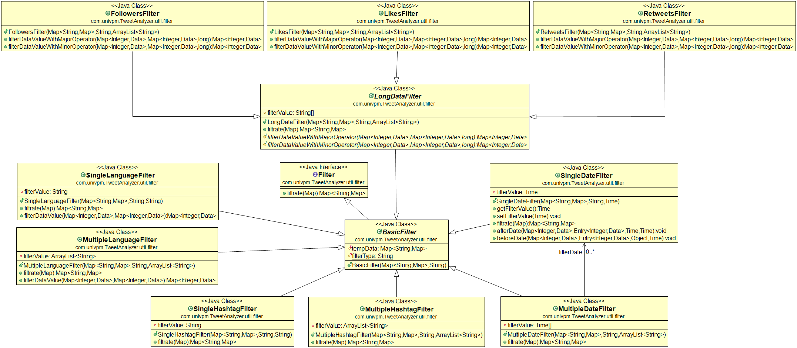

# Tweet Analyzer
Tweet Analyzer è un'API scritta in Java in grado di interfacciare le API di Twitter per raccogliere dati inerenti all'utenza,
al fine di affrontare uno studio di analisi statistica dei dati raccolti.

## Class Diagram

